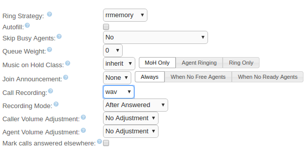

How do I store my Call Center recordings remotely?
--------------------------------------------------

You need to store your Call Center recordings, but the amount of space needed is giving you a headache. Is there a way to store your call recordings externally, in a secure and easy to access way?
Can I listen to the recordings directly from QueueMetrics?

CallCabinet for QueueMetrics
----------------------------

In this tutorial, we will detail how to setup your QueueMetrics system in order for it to retrieve call recordings stored with Atmos CallCabinet For QueueMetrics Solution.
This guide is divided in two sections: first, we will setup our Asterisk system so that it will automatically store our recordings on CallCabinet, after that we will setup our QueueMetrics system  to be able to retrieve the recordings for QA purposes.


Asterisk Setup
--------------

**Prerequisites**: 
In order to store your files on CallCabinet  we must make sure CCModule is installed and running on your system. For more information on how to setup CCModule, please refer to the following guide:

https://www.callcabinet.com/knowledge-base/setting-atmos-call-recording-asterisk/

Make also sure that your PBX records your calls, saving them with the following filename format:

Inbound calls: **in**-**AgentExtension**-**CustomerNumber**-**Date**-**Time**-**AsteriskUniqueID**.WAV

Outbound calls: **out**-**CustomerNumber**-**AgentExtension**-**Date**-**Time**-**AsteriskUniqueID**.WAV 

Now we need Asterisk to record our calls and place them in our repository folder (the folder specified in Ccconfig.txt). In this example we will use a Elastix-FreePbx system on a Centos 7 machine.

First, let's turn on the recording feature for all calls on our queue.



Now, we need to enable a Post-Recording script that renames and moves the recordings to our repository (Default is /home/callcabinet/recordings). We will use a script called moverec.sh from Atmos, albeit a slightly modified version. Copy and paste the following lines and save them as moverec.sh.

```
#!/bin/bash

#Log File
LOGFILE="/home/callcabinet/move.out"

# Logic in the script is as follows:
# 1) Calculate call duration (note - this goes from the call start time, 
# which is not necessarily the start of the call recording):
CALLSTART=${5}T${6}
CALLSTARTSEC=`date -d "${5} ${6}" "+%s"`
CALLENDSEC=`date  "+%s"`
#Confirm the location of the recordings as set in the CCModule
CCSTAGING=/home/callcabinet/recordings

FOLDERS=`date +"%Y/%m/%d"`

#CALLDUR=$((CALLENDSEC-CALLSTARTSEC))
CALLDUR=0

SRCFILE=${1}

if [ "${CALLDUR}" -le 0 ]
then
  CALLDUR=0
fi

#2) Call Direction (there are easier ways to do this)
# Determine in our out call from prefix
FILEBASE=`basename $SRCFILE`
CALLDIR=${FILEBASE%%-*}

#We get the agent extension from the filename


if [ "${CALLDIR}" = "IN" ] || [ "${CALLDIR}" = "in" ] || [ "${CALLDIR}" = "" ]
then
   CALLDIR="INCOMING"
   REMOTENUM=${CALLER}
   USEREXT=${AMPUSER}

   if [ -z "${USEREXT}" ]
   then
      USEREXT=`echo $FILEBASE | cut -d '-' -f 2`
   fi

   if [ -z "${REMOTENUM}" ]
   then
      REMOTENUM=`echo $FILEBASE | cut -d '-' -f 3`
   fi

fi
 
if [ "${CALLDIR}" = "OUT" ] || [ "${CALLDIR}" = "out" ] || [ "${CALLDIR}" = "force" ]
then

   CALLDIR="OUTGOING"
   USEREXT=${AMPUSER}
   REMOTENUM=${CALLED}

   if [ -z "${USEREXT}" ]
   then
      USEREXT=`echo $FILEBASE} | cut -d '-' -f 3`
   fi

   if [ -z "${REMOTENUM}" ]
   then
      REMOTENUM=`echo $FILEBASE | cut -d '-' -f 2`
   fi

fi

#3) Rename the file
DSTFILE=${CALLSTART}_${CALLDUR}_${CALLDIR}_${REMOTENUM}_${USEREXT}_${8}.WAV
mkdir -p /home/callcabinet/recordings/${FOLDERS}
mv ${SRCFILE}* ${CCSTAGING}/${FOLDERS}/${DSTFILE}

echo '------------------------------------'>> ${LOGFILE}
echo 'Srcfile: ' ${SRCFILE} >> ${LOGFILE}
echo 'Ccstaging ' ${CCSTAGING} >> ${LOGFILE}
echo 'Folders: ' ${FOLDERS} >> ${LOGFILE}
echo 'Destfile: ' ${DSTFILE} >> ${LOGFILE}
echo 'Callerid(number):' ${3} >> ${LOGFILE}
echo 'CDR(dst):' ${4} >> ${LOGFILE}
echo 'CDR(start):' ${5} ${6} >> ${LOGFILE}
echo 'CDR(src):' ${7} >> ${LOGFILE}
echo 'UNIQUEID:' ${8} >> ${LOGFILE}
echo 'DURATION:' ${CALLDUR} >> ${LOGFILE}
echo 'DIRECTION:' ${CALLDIR} >> ${LOGFILE}
echo 'AMPUSER:' ${AMPUSER} >> ${LOGFILE}
echo 'REMOTENUM:' ${REMOTENUM} >> ${LOGFILE}
echo 'CALLED:' ${CALLED} >> ${LOGFILE}
echo 'CALLER:' ${CALLER} >> ${LOGFILE}
echo '------------------------------------'>> ${LOGFILE}

```
We then place the moverec.sh into /usr/share/asterisk/agi-bin/ .This script automatically renames and replaces your recordings in your repository, using a specific name format that contains various information about the recording, so that it can be easily retrieved later on.

We must make sure that the variable CCSTAGING is set to our repository folder, in our case this is /home/callcabinet/recordings.

Now, in order for the script to work, we must instruct FreePbx to execute it as a Post-Recording operation. To do so let's go to FreePBX Advanced Settings.


As we can see, there is a field called Post Call Recording Script. Here is where we must indicate the location of our moverec.sh script, together with a few parameters the script needs to work properly. If you saved moverec.sh in the /usr/share/asterisk/agi-bin/ folder, you should write:

/usr/share/asterisk/agi-bin/moverec.sh ^{MIXMONITOR_FILENAME} "^{AMPUSER}" "^{CALLERID(number)}" "^{CDR(dst)}" ^{CDR(start)} "^{CDR(src)}" ^{UNIQUEID} "^{AGENTEXTEN}"

Remember that the moverec.sh script must be executable by the asterisk user.

The last thing we need to do is to make sure that in the CCconfig.txt configuration file, we set the following parameters like this:

```
FileNameDelimiter:<_>
FileNamePos1:<DateTime>
FileNamePos2:<Duration>
FileNamePos3:<Direction>
FileNamePos4:<Number>
FileNamePos5:<Ext>
FileNamePos6:<CustomerInternalRef>
Treesupport:<yes>
```

If everything has been correctly set up, you should now find your recordings in your CallCabinet web repository. 


QueueMetrics Setup
------------------

To make sure QueueMetrics looks for your recordings on your CallCabinet online repository, you need only three things:

Your CallCabinetForQm Customer ID.
Your CallCabinetForQm Site ID.
The Valid CallCabinetForQm API Key.

The Customer ID, Site ID and API Key, are sent to you when you activate your CallCabinetForQm account.

Once we have all of the above information, from QueueMetrics homepage we must go to Edit System Parameters and edit the following parameters:
```
audio.server=it.loway.app.queuemetrics.callListen.listeners.CallCabinetForQmListener
default.callcabinet.customer_id=****
default.callcabinet.site_id=****
default.callcabinet.api_key=****
audio.html5player=true
```

Make sure you replace the **** characters with your Customer ID, Site ID and API Key. The audio.html5player=true parameter instead, enables us to listen to the recordings directly on our browser.


We should be ready now, let's go back to the HomePage and take a look at any report containing some of the calls that we recorded.


If we click on the Call Detail Icon (the magnifying glass icon on the right), we can see at the bottom that QueueMetrics retrieves the recordings related to that call's Call ID.


The name format QueueMetrics uses to represent a recording is the following:
```
DateTime_agent_queue.mp3
```
If we click on the Play icon just right of the recording name we can stream the recording directly without downloading it.


If we wish to download it instead, we can click on the recording name. 


Recording Outbound Calls
------------------------

The moverec.sh script that is used to move the recordings to the staging folder, is able to recognize if the recorded calls are inbound or outbound calls. In order to distinguish between the two, we must save outbound call recordings in a different location than we do with inbound recordings.

The location we need to save outbound recordings to, is the /var/spool/asterisk/monitor/temp folder.

In order to do this, we will customize the part of QueueMetrics dialplan that allows agents to make outbound calls from the agent page.

Go to 

```
/etc/asterisk/extensions_queuemetrics.conf
```

Scroll down until you reach extension 28 (agent custom dial), and replace it with the follwoing:

```
; extension 28: agent custom dial 
exten => 28,1,Answer 

; Multiline, must be written as a single line in the dialplan
;---------------------------------------------------------------
exten => 28,n,NoOp( "QM: Agent Custom Dial. Dialing ${EXTTODIAL} 
on queue ${OUTQUEUE} made by '${QM_LOGIN}'" ) 
;---------------------------------------------------------------

exten => 28,n,Set(QDIALER_QUEUE=${OUTQUEUE}) 
exten => 28,n,Set(QDIALER_NUMBER=${EXTTODIAL}) 
exten => 28,n,Set(QDIALER_AGENT=SIP/${AGENTCODE}) 
exten => 28,n,Set(QDIALER_CHANNEL=SIP/${QDIALER_NUMBER}) 
exten => 28,n,Set(QueueName=${QDIALER_QUEUE}) 

; Multiline, must be written as a single line in the dialplan
;---------------------------------------------------------------
exten => 28,n,Set(CALLFILENAME=OUT-${QDIALER_NUMBER}-${AGENTCODE}-
${STRFTIME(${EPOCH},,%Y%m%d-%H%M%S)}-${UNIQUEID}) 
;---------------------------------------------------------------

; Multiline, must be written as a single line in the dialplan
;---------------------------------------------------------------
exten => 28,n,MixMonitor(/var/spool/asterisk/monitor/${STRFTIME(${EPOCH},,%Y-%m/%d)}/
${CALLFILENAME}.${MIXMON_FORMAT},b,${MIXMON_POST}) 
;---------------------------------------------------------------

exten => 28,n,Goto(qm-queuedial,s,1) 
exten => 28,n,Hangup

```

**NOTE: Some parts of the above dialplan piece are too long to fit in the document. They have been marked so that when you copy this part in the dialplan you know which must be written as a single line. Remember that each line in you dialplan should start with "exten =>".**

Now, after reloading Asterisk's dialplan, we will find that our outbound calls are also being recorded and moved to the staging folder correctly. They will then be uploaded to your CallCabinet For QueueMetrics account.


Multi-Site Configuration
------------------------

QueueMetrics and CallCabinet both offer support for Multi-Site configurations, where the same customer has the need to monitor different PBXs with the need to differentiate between recorded files.

In CallCabinet, this is simply arranged by logging in the CallCabinet HomePage then going to Settings -> Site -> Add New Site.


Doing this, will provide you with a different Site ID that will be used to access stored data coming from the New Site.

On the QueueMetrics side instead, we find the Cluster Functionality that is meant to allow the user to monitor different PBXs through the same QueueMetrics System.

In order to setup the Cluster Functionality correctly please refer to the QueueMetrics Manual. 

http://manuals.loway.ch/QM_UserManual-chunked/ch20.html

Clusters allow the user to define different System Parameters for different PBXs, let's take a look at how it would work in a situation where we have two different PBXs named respectively Alice and Bob.


As we can see we will have defined, in the Edit System Parameters page, the names of the different PBX Servers, with the system property:
```
cluster.servers=alice|bob
```
Different PBX names will be separated with the “|” Pipe symbol. To define which PBX we want QueueMetrics to monitor we use the property:
```
default.queue_log_file=cluster:*
```
In this case we want QueueMetrics to monitor all of them so we use the “*” Star symbol, otherwise we could use the names of the different servers to monitor, separating them with the “|” Pipe symbol.

Now, we can define properties specific to each PBX Server, by using the following syntax:
```
cluster.alice.callcabinet.customer_id=****
cluster.alice.callcabinet.site_id=****
cluster.alice.callcabinet.api_key=****
```
So, by using the prefix `cluster.ServerName.SystemParameter`, where ServerName is the name of the PBX (e.g. `alice`) and SystemParameter is the name of the System Property to be set (e.g. `default.callcabinet.site_id`, without the `default.` prefix), we can allow the same properties to have different values depending on the server we are currently monitoring.

After logging out and back in again, to make sure the changes to the System Parameters can take effect, we can launch a new report and take a look at the Call Details.


As we can see, now QueueMetrics populates the Srv field with the name of the PBX Server on which the call took place. If we open the the Call Details, QueueMetrics will access CallCabinet using the Site_ID, Customer_ID and Api_Key, we specified for that particular PBX Server.


QueueMetrics References
-----------------------

For more technical information about QueueMetrics call center solution please refer to the [User Manual](https://www.queuemetrics.com/manual_list.jsp).

Visit [www.queuemetrics.com](https://www.queuemetrics.com/) for a 30 days full featured trial.

Attend our [Free Webinars](https://v1.bookwhen.com/loway) for a live demonstration of QueueMetrics.